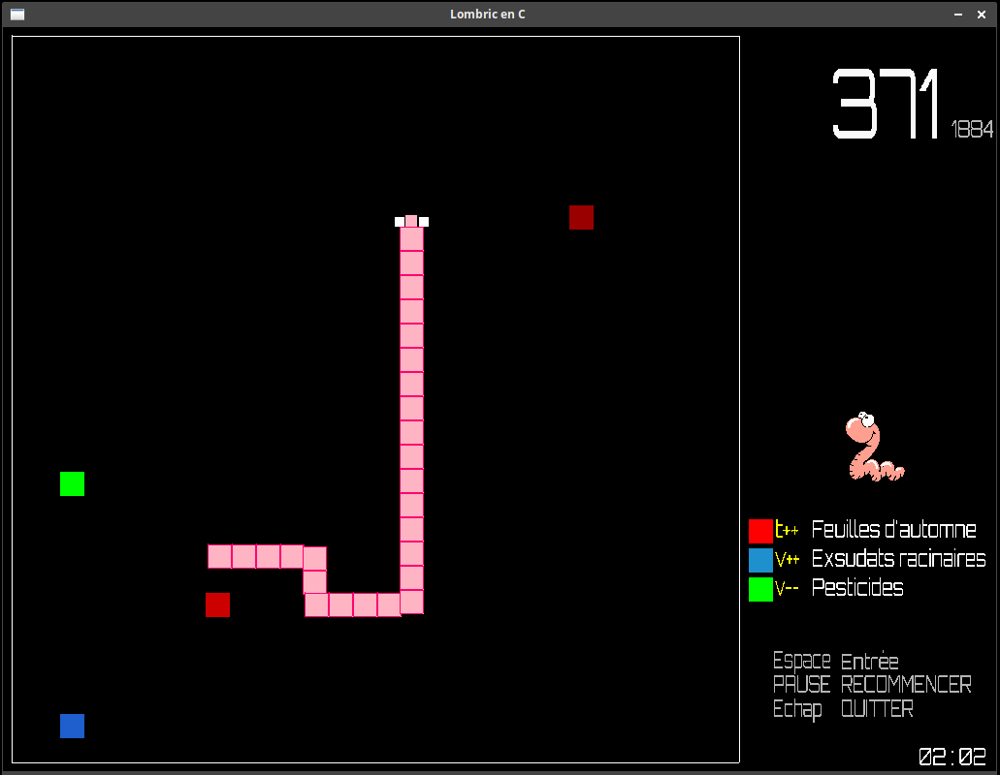

## Lombric en C

par Sébastien Abilla

MIT License (voir LICENSE)

https://github.com/sebabilla/lombric

### C'est quoi?

C'est un Snake-like game (original: Taneli Armanto, 1997) développé en C avec la SDL.  
Dans "Lombric in C", il faut gérer le type de nourriture ingérée pour survivre le plus longtemps possible et devenir très très long.  
Jouable au clavier ou à la manette. 
Mon deuxième jeu, le but était d'utiliser les fonctions malloc() / free(), des listes et des recursions, et qu'à la fin valgrind ne grogne pas.

Un aperçu de la jouabilité [en vidéo](https://youtu.be/YMGR30RZDko)  



### Windows (testé sur Windows 10 64 bits)

Télécharger et décompresser **[lombric_windows.0.1.zip](https://github.com/sebabilla/lombric/releases/download/v0.2/lombric_windows.0.2.zip)** puis lancer **lombric.exe**.

### Linux (testé sous Xubuntu 21.10 64 bits)

Il faut avoir installé préalablemement:

```bash
libsdl2
libsdl2-mixer
libsdl2-ttf
```
Télécharger et décompresser **[lombric_linux.0.1.zip](https://github.com/sebabilla/lombric/releases/download/v0.2/lombric_linux.0.2.zip)** puis lancer **lombric**. (éventuellement rendre le fichier executable avec un clic droit)

### Compilation

Pour pouvoir compiler, il faut avoir installé:

```bash
libsdl2-dev
libsdl2-mixer-dev
libsdl2-ttf-dev
```
puis entrer dans un terminal: 

```bash
gcc *.c -Wall -o lombric -lSDL2_ttf -lSDL2_mixer $(sdl2-config --cflags --libs)
```

### Crédits

De nombreuses parties du code sont adaptées ou inspirées de:
* CS50x by David J. Malan https://cs50.harvard.edu/x/2021
* FormationVideo - C cours by Jason Champagne https://www.youtube.com/c/Formationvidéo8/

Sons:
* Tous extraits de sons bruts téléchargés sur LaSonothèque de Joseph Sardin https://lasonotheque.org/apropos.html

Font:
* Orbitron  par Matt McInerney (Open Font License)


